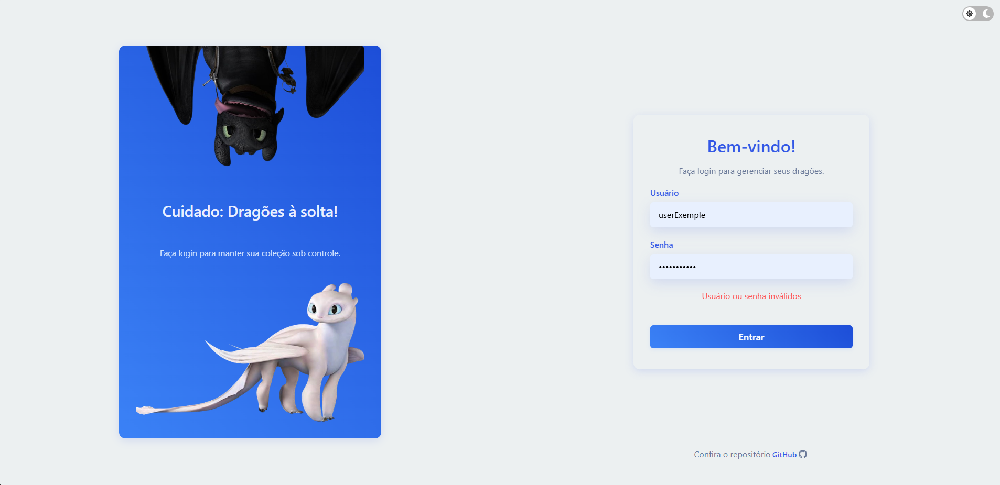
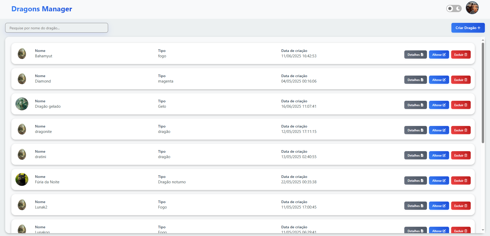

# 🐉 Dragons Manager


Uma aplicação React para gerenciamento de dragões via API externa, com sistema de autenticação local e CRUD completo.

---

## 🖼️ Demonstração

| Login | List |
|-------|------|
| | |

Acesse a demo online:  
👉 [https://www.dragons-manager.dankacode.com.br](https://www.dragons-manager.dankacode.com.br)

Credenciais de Teste

```plaintext
Usuário: userExample
Senha: passExample
```

---

## 📋 Funcionalidades

- Autenticação local (sem backend)
- Listagem de dragões ordenada alfabeticamente
- Cadastro, edição e exclusão de dragões
- Visualização de detalhes de cada dragão

---

## 🚀 Tecnologias Utilizadas

- [React](https://react.dev/)
- [Vite](https://vitejs.dev/) 
<br>
- SCSS Modules  
  <sub><i>Estilos com escopo local, usando sintaxe SCSS</i></sub>

- CSS puro via SCSS (Sass)  
  <sub><i>Sem bibliotecas de UI externas, apenas estilização customizada</i></sub>
  
---

## ⚙️ Pré-requisitos
- Node.js (versão 16 ou superior)
- npm ou yarn
- Git

---

## 🔧 Configuração
Crie um arquivo `.env` na raiz do projeto baseado no `.env.example`:
```bash
cp .env.example .env
```
Edite o arquivo `.env` se necessário.

---

## 🗂️ Estrutura de Pastas

```plaintext
📦 src  
┣━ 📜 App.jsx  
┣━ 📂 assets  
┃     ┗━ 📂 images  
┣━ 📂 components  
┃     ┣━ 📂 Button  
┃     ┃     ┣━ 📜 Button.jsx  
┃     ┃     ┗━ 📜 Button.module.scss  
┃     ┃ 
┃     ┣━ 📂 ConfirmDeleteModal  
┃     ┃     ┣━ 📜 ConfirmDeleteModal.jsx  
┃     ┃     ┗━ 📜 ConfirmDeleteModal.module.scss  
┃     ┃ 
┃     ┣━ 📂 DragonCard  
┃     ┃     ┣━ 📜 DragonCard.jsx  
┃     ┃     ┗━ 📜 DragonCard.module.scss  
┃     ┃ 
┃     ┣━ 📂 Dropdown  
┃     ┃     ┣━ 📜 Dropdown.jsx  
┃     ┃     ┗━ 📜 Dropdown.module.scss  
┃     ┃ 
┃     ┣━ 📂 GenericForm  
┃     ┃     ┣━ 📜 GenericForm.jsx  
┃     ┃     ┗━ 📜 GenericForm.module.scss  
┃     ┃ 
┃     ┣━ 📂 Input  
┃     ┃     ┣━ 📜 Input.jsx  
┃     ┃     ┗━ 📜 Input.module.scss  
┃     ┃ 
┃     ┣━ 📂 List  
┃     ┃     ┣━ 📜 List.jsx  
┃     ┃     ┗━ 📜 List.module.scss  
┃     ┃ 
┃     ┣━ 📂 LoadingOverlay  
┃     ┃     ┣━ 📜 LoadingOverlay.jsx  
┃     ┃     ┗━ 📜 LoadingOverlay.module.scss  
┃     ┃ 
┃     ┣━ 📂 Search  
┃     ┃     ┣━ 📜 Search.jsx  
┃     ┃     ┗━ 📜 Search.module.scss  
┃     ┃ 
┃     ┣━ 📂 SwitchButton  
┃     ┃     ┣━ 📜 SwitchButton.jsx  
┃     ┃     ┗━ 📜 SwitchButton.module.scss  
┃     ┃ 
┃     ┗━ 📂 Toast  
┃     ┃     ┣━ 📜 Toast.jsx  
┃     ┃     ┗━ 📜 Toast.module.scss
┣━ 📂 contexts  
┃     ┣━ 📜 AuthContext.jsx  
┃     ┣━ 📜 ThemeContext.jsx  
┃     ┗━ 📜 ToastContext.jsx
┣━ 📂 layout  
┃     ┣━ 📂 AppLayout  
┃     ┃     ┣━ 📜 AppLayout.jsx  
┃     ┃     ┗━ 📜 AppLayout.module.scss  
┃     ┃ 
┃     ┗━ 📂 Header  
┃           ┣━ 📜 Header.jsx  
┃           ┗━ 📜 Header.module.scss  
┣━ 📜 main.jsx  
┣━ 📂 pages  
┃     ┣━ 📂 CreateDragon  
┃     ┃     ┗━ 📜 CreateDragon.jsx  
┃     ┃ 
┃     ┣━ 📂 DragonDetails  
┃     ┃     ┣━ 📜 DragonDetails.jsx  
┃     ┃     ┗━ 📜 DragonDetails.module.scss  
┃     ┃ 
┃     ┣━ 📂 DragonList  
┃     ┃     ┣━ 📜 DragonList.jsx  
┃     ┃     ┗━ 📜 DragonList.module.scss  
┃     ┃ 
┃     ┣━ 📂 DragonUpdate  
┃     ┃     ┗━ 📜 DragonUpdate.jsx  
┃     ┃ 
┃     ┗━ 📂 Login  
┃           ┣━ 📜 Login.jsx  
┃           ┗━ 📜 Login.module.scss  
┣━ 📂 routes  
┃     ┣━ 📜 AppRoutes.jsx  
┃     ┣━ 📜 PrivateRoute.jsx  
┃     ┗━ 📜 PublicRoute.jsx  
┣━ 📂 services  
┃     ┣━ 📜 Api.js  
┃     ┣━ 📜 AuthService.js  
┃     ┗━ 📜 DragonService.js  
┣━ 📂 styles  
┃     ┣━ 📜 _variables-dark.scss  
┃     ┣━ 📜 _variables-light.scss  
┃     ┗━ 📜 global.scss  
┗━ 📂 utils  
      ┣━ 📜 cookieUtils.js  
      ┣━ 📜 dragons.json  
      ┗━ 📜 formatDate.js  


```

---

## 🌐 API de Referência

**Base URL:**  
`http://5c4b2a47aa8ee500142b4887.mockapi.io/api/v1`

| Método | Endpoint         | Descrição                |
|--------|------------------|-------------------------|
| GET    | `/dragon`        | Listar todos os dragões |
| GET    | `/dragon/:id`    | Detalhes de um dragão   |
| POST   | `/dragon`        | Criar novo dragão       |
| PUT    | `/dragon/:id`    | Atualizar dragão        |
| DELETE | `/dragon/:id`    | Remover dragão          |

---

## 🔒 Autenticação

O sistema usa um token `JWT` simulado armazenado em cookies seguros:

- **Credenciais pré-definidas no `.env`**
  - Usuário: `userExample` v
  - Senha: `passExample`
- Token com expiração de 1 hora
- Proteção de rotas via contexto React
- Dados do usuário codificados no token

---

## ⚡ Instalação e Uso

```bash
git clone https://github.com/thiagodanka/dragons-manager.git
cd dragons-manager
npm install
npm run dev
```

---

## 📄 Licença

Projeto desenvolvido exclusivamente para fins de avaliação técnica.

